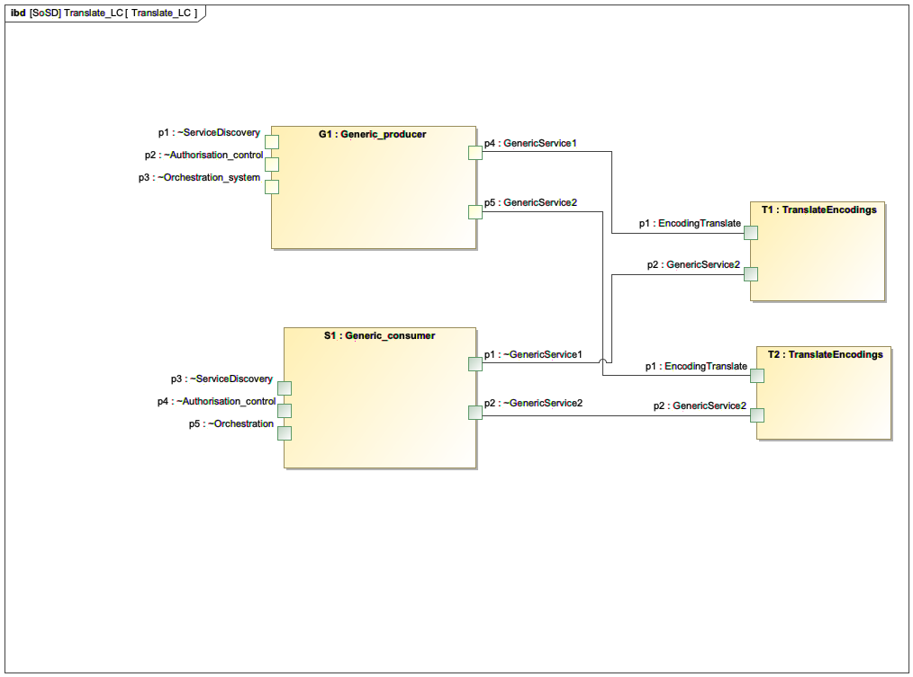

# Source template

[arrowhead-kalix-examples/echo-cloud](https://github.com/arrowhead-f/arrowhead-kalix-examples/tree/master/echo-cloud)

License: [EPL-2.0 License](https://github.com/arrowhead-f/arrowhead-kalix-examples/blob/master/LICENSE)

# Instructions

## Requirements

- Provide a system that can consume data encoded in XML, JSON or CBOR and can produced the same data in XML, JSON and CBOR
- Dynamically instantiated and orchestrated by Orchestration system
- Possible as a plug-in to the Translation system

1. Demonstrated in one local cloud, having one Producer (XML) and Consumer   (JSON) with dashboard visualisation

Make use of existing converters XML <-> JSON <-> CBOR

## SoSD Translate

A system producing a service using XML encoded of payload. A corresponding Consumer
system capable of understanding JSON and CBOR encoded payload.

An encoding translation system capable of consuming services producing data encoded inb
XML, JSON and CBOR. This system shall then convert the XML, JSON, or CBOR payload to JSON,
XML and CBOR depending of the requested translation.

## Visualisation

For the local cloud demo a visualisation system of the original and translated payload data
shall be provided. This system shall consume both the original produced data and the
translated data

## Security

Security shall be used by all systems and services included.

As per the Arrowhead approach, Local Clouds are governed through
their own instances of the Core Systems. There are two main groups
of the Core Systems:
- The mandatory ones that need to be present in each Local Cloud,
and
- The automation supporting ones that further enhance the core
capabilities of a Local Cloud.

---

--- 

## TBC ...